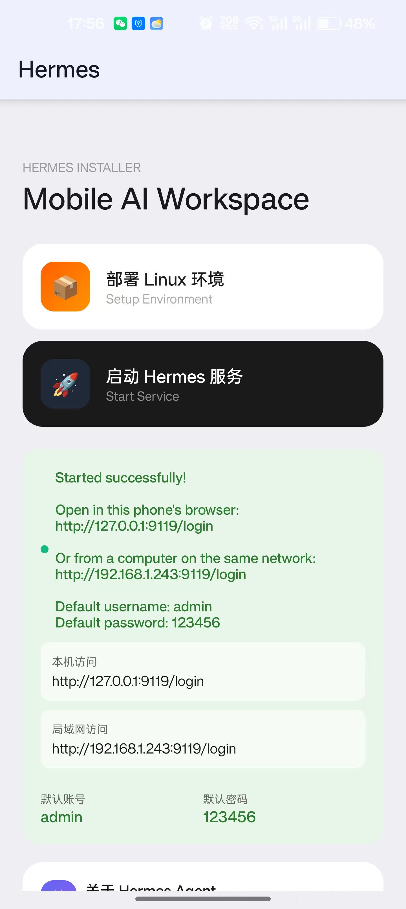

[English](README.md) | [简体中文](README.zh-CN.md)

# 🚀 Pocket Hermes

**One-click deployment of Hermes Agent on Android — designed for everyone, no tech skills required.**

## ✨ What can it do?

After installing the APK, simply follow the on-screen guide step by step:

1. **Auto-install Termux** — no manual setup required
2. **Auto-deploy Hermes Agent** — fully installed inside Termux
3. **Auto-restore preset config** — ready to use out of the box

> A fully graphical setup — no command line or technical background needed.

Comes with **unlimited gemini-3.6-flash** access, plus a **3-day free trial** for new users. A built-in WeChat integration Skill (`/weixin-login`) lets you link your WeChat account with a single command.

## 📱 How it works

Download the APK → Install → Open the app → Follow the steps → Done 🎉

## 💰 Pricing

A subscription is required to continue after the free trial ends:

- **Users in China**: ¥10/month, purchase at [hanhanhu.cn](http://hanhanhu.cn) (Alipay & WeChat Pay supported), get your registration code after payment
- **International users**: Please subscribe via the Google Play Store

## 🔧 Requirements

- Android 8.0 or later
- ≥ 2GB free storage (recommended)
- Internet connection (required to download dependencies during setup)

## 🚀 Quick Start

1. Go to [Releases](../../releases) and download the latest APK
2. Allow "Install from unknown sources"
3. Open the app and follow the guide to complete setup — enjoy a 3-day free trial
