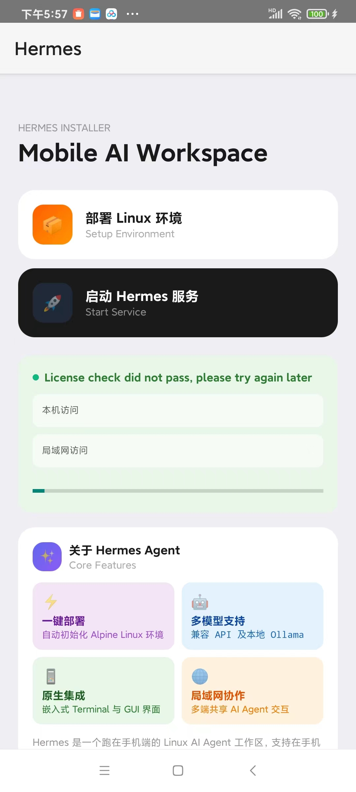
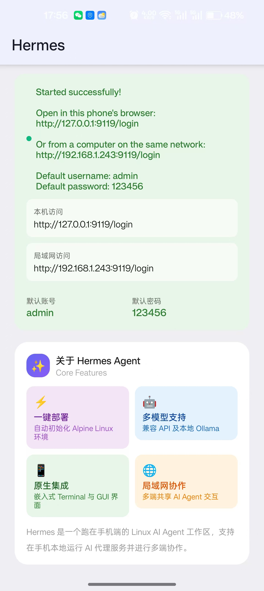
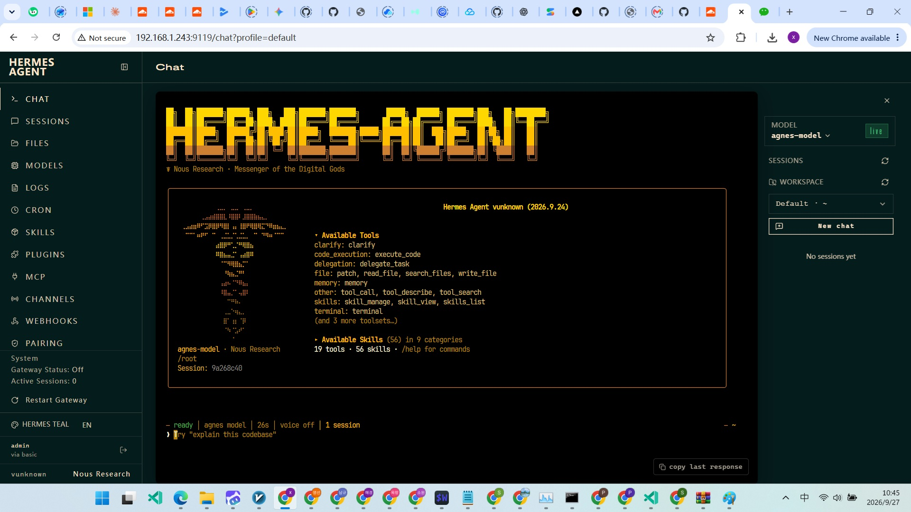
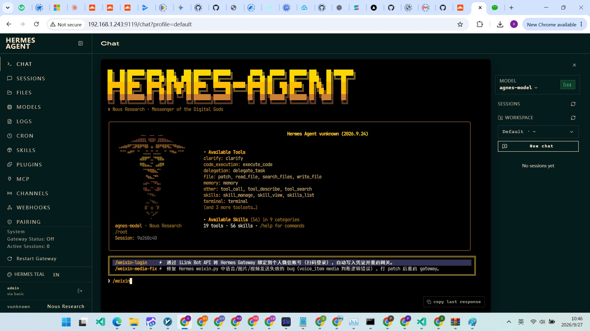
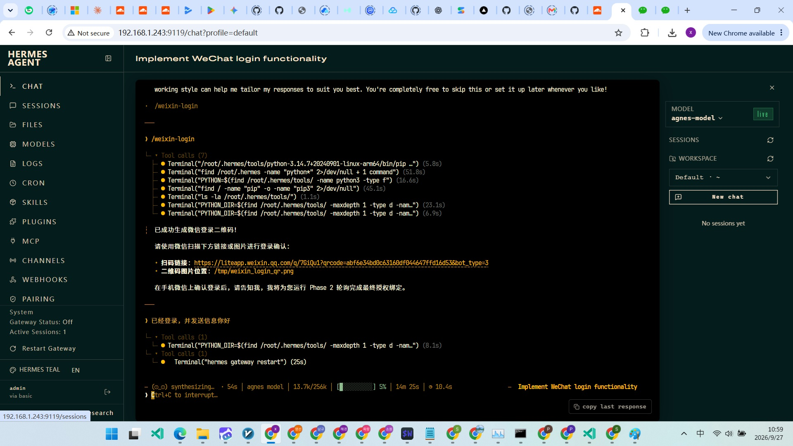

[English](README.md) | [简体中文](README.zh-CN.md)

# 🚀 Hermes agent on android

**一键在安卓手机上部署 Hermes Agent，开箱即用，微信个人助手。**

## ✨ 它能做什么？

安装 APK 后，只需跟着页面引导，一步一步操作：

1. **自动安装 ubuntu** — 无需手动下载配置
2. **自动部署 Hermes Agent** — 在 ubuntu 中完成全部安装
3. **自动恢复预配置** — 开箱即用，初始化配置一键还原

> 全程图形化引导，不需要任何命令行或技术基础。

内置 **gemini-3.6-flash** 无限量调用，**新用户免费试用 3 天**。同时预置了对接微信的 Skill（`/weixin-login`），一条指令即可完成微信登录绑定。
> 

## 📱 使用流程

下载 APK → 安装 → 打开 APP → 按步骤点击 → 完成 🎉

## 💰 价格

试用期结束后需订阅才能继续使用：

- **国内用户**：月租 ¥10，前往 [hanhanhu.cn](http://hanhanhu.cn) 购买，支持支付宝、微信支付，付款后获取注册码
- **海外用户**：请前往 Google Play 商店下载订阅

## 🔧 系统要求

- Android 8.0 及以上
- 存储空间 ≥ 2GB（建议）
- 网络连接（安装过程需要下载依赖）

## 🚀 快速开始

1. 前往 [Releases](../../releases) 下载最新 APK
2. 允许"安装未知来源应用"
3. 打开 APP，跟随引导完成部署，可享 3 天免费试用
